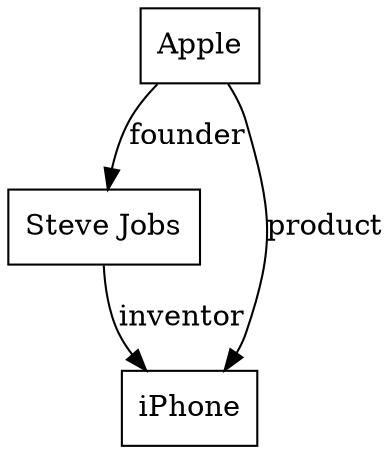

Question:

Reply in Chinese (Simplified).
The following is a search input in a search engine, giving useful content or solutions and as much information as you can related to it, use markdown syntax to make your answer more readable, such as code blocks, bold, list:
语义搜索

Answer:

Searching the web for: `语义搜索`好，这是Bing。😊

语义搜索是一种信息检索过程，它侧重于搜索查询背后的意图，而不是传统的关键词匹配。1 语义搜索的目的是更准确地捕捉到用户的需求，并返回最相关的搜索结果。2

语义搜索的原理是基于搜索者意图、查询上下文和单词之间的关系进行理解。3 语义搜索还利用了知识图谱、实体识别和向量检索等技术来提高搜索效率和质量。4 5

如果你想了解更多关于语义搜索的内容，你可以点击以下链接：

- [什么是语义搜索？它是如何影响SEO的 - Ahrefs](https://ahrefs.com/blog/zh/semantic-search/)
- [语义搜索：它是什么以及为什么它对当今的SEO很重要 - 知乎](https://zhuanlan.zhihu.com/p/394800007)
- [知识图谱入门 (八) 语义搜索 - 知乎](https://zhuanlan.zhihu.com/p/39237778)
- [语义索引（向量检索）的几类经典方法 - 知乎](https://zhuanlan.zhihu.com/p/161467314)

你对语义搜索有什么特别的兴趣或需求吗？我可以帮你找到更具体的信息或解决方案。

\-
\[1]: [什么是语义搜索？它是如何影响SEO的 - Ahrefs](https://ahrefs.com/blog/zh/semantic-search/)
\[2]: [语义搜索引擎和关键词搜索引擎有什么本质区别？ - 知乎](https://www.zhihu.com/question/437473985)
\[3]: [语义搜索：它是什么以及为什么它对当今的SEO很重要 - 知乎](https://zhuanlan.zhihu.com/p/394800007)
\[4]: [知识图谱入门 (八) 语义搜索 - 知乎 - 知乎专栏](https://zhuanlan.zhihu.com/p/39237778)
\[5]: [语义索引（向量检索）的几类经典方法 - 知乎 - 知乎专栏](https://zhuanlan.zhihu.com/p/161467314)

Question:

上文中“知识图谱”是什么？

Answer:

Searching the web for: `知识图谱`识图谱是一种知识库，它使用图形结构来表示现实世界中的实体和它们之间的关系。1 2 知识图谱可以用于描述物理对象、事件、状况或概念，以及它们的属性和语义。3 知识图谱的基本组成单位是“实体—关系—实体”三元组，以及实体及其相关属性—值对。3 4

例如，下面是一个简单的知识图谱，描述了苹果公司、乔布斯和iPhone之间的关系：

如果你想了解更多关于知识图谱的内容，你可以点击以下链接：

- [知识图谱（多学科融合目的的现代理论）_百度百科](https://baike.baidu.com/item/知识图谱/8120012)
- [什么是知识图谱？ | IBM](https://www.ibm.com/cn-zh/topics/knowledge-graph)
- [知识图谱入门——认识知识图谱 - 知乎](https://zhuanlan.zhihu.com/p/396516565)
- [Knowledge graph - Wikipedia](https://en.wikipedia.org/wiki/Knowledge_graph)

你对知识图谱有什么特别的兴趣或需求吗？我可以帮你找到更具体的信息或解决方案。

\-
\[1]: [知识图谱（多学科融合目的的现代理论）_百度百科](https://baike.baidu.com/item/知识图谱/8120012)
\[2]: [什么是知识图谱？ | IBM](https://www.ibm.com/cn-zh/topics/knowledge-graph)
\[3]: [知识图谱入门——认识知识图谱 - 知乎 - 知乎专栏](https://zhuanlan.zhihu.com/p/396516565)
\[4]: [什么是知识图谱? - 知乎](https://zhuanlan.zhihu.com/p/71128505)
\[5]: [Knowledge graph - Wikipedia](https://en.wikipedia.org/wiki/Knowledge_graph)

