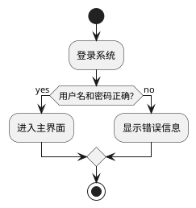
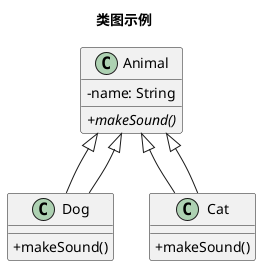

Question:

Reply in Chinese (Simplified).
The following is a search input in a search engine, giving useful content or solutions and as much information as you can related to it, use markdown syntax to make your answer more readable, such as code blocks, bold, list:
plantuml 图

Answer:

您好，这是Bing。我可以用中文（简体）回复您。😊

PlantUML是一款开源的UML图绘制工具，支持通过文本来生成图形，使用起来非常高效。1 2 它可以支持时序图、类图、对象图、活动图、思维导图等图形的绘制。1 4

要使用PlantUML，您需要编写一种简单直观的语言，用来描述您想要的图形。4 您可以参考PlantUML语言参考指南4 来了解更多语法规则和示例。您也可以使用一些在线工具，如PlantText5 来实时预览和编辑您的代码。

下面是一个使用PlantUML来绘制一张流程图的例子，您可以看到代码和对应的图形：

如果您想了解更多关于PlantUML的信息，您可以访问它的官方网站4 或者GitHub仓库2。您也可以阅读一些相关的文章，如1 3 6 等。

\-
\[1]: [PlantUML画图软件简介 - 知乎](https://zhuanlan.zhihu.com/p/427358291)
\[2]: [plantuml/plantuml: Generate diagrams from textual description - Github](https://github.com/plantuml/plantuml)
\[3]: [使用简单的文字描述画UML图的开源工具。 - PlantUML.com](https://plantuml.com/zh/)
\[4]: [PlantText UML Editor](https://www.planttext.com/)
\[5]: [个人日志 - PlantUML - 程序员必备绘图工具，不只是UML- Coder行](https://www.coderxing.com/plantuml-the-best-uml-tools.html)
\[6]: [ChatGPT+PlantUML说说话就能搞定所有建模图 - 掘金](https://juejin.cn/post/7222454394020577339)

Question:

PlantUML语法规则

Answer:

PlantUML语法规则是指用来描述图形的文本语言的规则。1 PlantUML支持多种类型的图形，每种图形都有自己的语法规则和关键字。1 2 3 4

一般来说，PlantUML语法规则遵循以下原则：

- 每个图形都需要用`@startuml`和`@enduml`标记开始和结束。1
- 每个图形都可以有一个标题，用`title`关键字指定。1
- 每个图形都可以有一些设置选项，用`skinparam`关键字指定。1
- 每个图形都可以包含一些元素，如类、对象、活动、状态等，用不同的符号或关键字表示。1
- 每个元素都可以有一些属性，如名称、颜色、样式等，用方括号或括号表示。1
- 每个元素之间都可以有一些关系，如继承、关联、依赖等，用不同的线条或箭头表示。1
- 每个关系都可以有一些标签，如角色、多重性、名称等，用双引号或冒号表示。1
- 每个图形都可以包含一些分组，如包、区域、循环等，用不同的符号或关键字表示。1
- 每个分组都可以有一个名称，用双引号或冒号表示。1

下面是一个使用PlantUML语法规则来绘制一个类图的例子，您可以看到代码和对应的图形：

如果您想了解更多关于PlantUML语法规则的信息，您可以访问它的官方网站1 或者GitHub仓库2。您也可以阅读一些相关的文章，如4 5 等。

\-
\[1]: [菜鸟指南 - PlantUML.com](https://plantuml.com/zh/starting)
\[2]: [Mac 配置 PlantUML - 知乎](https://zhuanlan.zhihu.com/p/107319002)
\[3]: [plantuml使用教程_chengbinbbs的博客-CSDN博客](https://blog.csdn.net/chengbinbbs/article/details/105998740)
\[4]: [（一）PlantUML 语法之时序图_plantuml语法_今天离目标是不是更远了的博客-CSDN博客](https://blog.csdn.net/youngyouth/article/details/88714047)
\[5]: [PlantUML画图软件简介 - 知乎](https://zhuanlan.zhihu.com/p/427358291)

