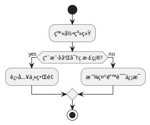
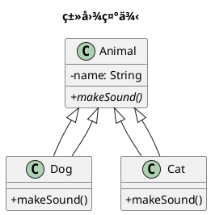

Question:

Reply in Chinese (Simplified).
The following is a search input in a search engine, giving useful content or solutions and as much information as you can related to it, use markdown syntax to make your answer more readable, such as code blocks, bold, list:
plantuml 图

Answer:

您好，这是Bing。我å¯ä»¥ç”¨ä¸­æ–‡ï¼ˆç®€ä½“）å›å¤æ‚¨ã€‚😊

PlantUML是一款开æºçš„UML图绘制工具，支æŒé€šè¿‡æ–‡æœ¬æ¥ç”Ÿæˆå›¾å½¢ï¼Œä½¿ç”¨èµ·æ¥é常高效。1 2 它å¯ä»¥æ”¯æŒæ—¶åºå›¾ã€ç±»å›¾ã€å¯¹è±¡å›¾ã€æ´»åŠ¨å›¾ã€æ€ç»´å¯¼å›¾ç­‰å›¾å½¢çš„绘制。1 4

è¦ä½¿ç”¨PlantUML，您需è¦ç¼–写一ç§ç®€å•ç›´è§‚的语言，用æ¥æ述您想è¦çš„图形。4 您å¯ä»¥å‚考PlantUML语言å‚考指å—4 æ¥äº†è§£æ›´å¤šè¯­æ³•è§„则和示例。您也å¯ä»¥ä½¿ç”¨ä¸€äº›åœ¨çº¿å·¥å…·ï¼Œå¦‚PlantText5 æ¥å®æ—¶é¢„览和编辑您的代ç ã€‚

下é¢æ˜¯ä¸€ä¸ªä½¿ç”¨PlantUMLæ¥ç»˜åˆ¶ä¸€å¼ æµç¨‹å›¾çš„例å­ï¼Œæ‚¨å¯ä»¥çœ‹åˆ°ä»£ç å’Œå¯¹åº”的图形：

如æœæ‚¨æƒ³äº†è§£æ›´å¤šå…³äºPlantUMLçš„ä¿¡æ¯ï¼Œæ‚¨å¯ä»¥è®¿é—®å®ƒçš„官方网站4 或者GitHub仓库2。您也å¯ä»¥é˜…读一些相关的文章，如1 3 6 等。

\-
\[1]: [PlantUML画图软件简介 - 知ä¹](https://zhuanlan.zhihu.com/p/427358291)
\[2]: [plantuml/plantuml: Generate diagrams from textual description - Github](https://github.com/plantuml/plantuml)
\[3]: [使用简å•çš„文字æè¿°ç”»UML图的开æºå·¥å…·ã€‚ - PlantUML.com](https://plantuml.com/zh/)
\[4]: [PlantText UML Editor](https://www.planttext.com/)
\[5]: [个人日志 - PlantUML - 程åºå‘˜å¿…备绘图工具，ä¸åªæ˜¯UML- Coderè¡Œ](https://www.coderxing.com/plantuml-the-best-uml-tools.html)
\[6]: [ChatGPT+PlantUML说说è¯å°±èƒ½æ定所有建模图 - æ˜é‡‘](https://juejin.cn/post/7222454394020577339)

Question:

PlantUML语法规则

Answer:

PlantUML语法规则是指用æ¥æ述图形的文本语言的规则。1 PlantUML支æŒå¤šç§ç±»å‹çš„图形，æ¯ç§å›¾å½¢éƒ½æœ‰è‡ªå·±çš„语法规则和关键字。1 2 3 4

一般æ¥è¯´ï¼ŒPlantUML语法规则éµå¾ªä»¥ä¸‹åŸåˆ™ï¼š

- æ¯ä¸ªå›¾å½¢éƒ½éœ€è¦ç”¨`@startuml`å’Œ`@enduml`标记开始和结æŸã€‚1
- æ¯ä¸ªå›¾å½¢éƒ½å¯ä»¥æœ‰ä¸€ä¸ªæ ‡é¢˜ï¼Œç”¨`title`关键字指定。1
- æ¯ä¸ªå›¾å½¢éƒ½å¯ä»¥æœ‰ä¸€äº›è®¾ç½®é€‰é¡¹ï¼Œç”¨`skinparam`关键字指定。1
- æ¯ä¸ªå›¾å½¢éƒ½å¯ä»¥åŒ…å«ä¸€äº›å…ƒç´ ï¼Œå¦‚ç±»ã€å¯¹è±¡ã€æ´»åŠ¨ã€çŠ¶æ€ç­‰ï¼Œç”¨ä¸åŒçš„符å·æˆ–关键字表示。1
- æ¯ä¸ªå…ƒç´ éƒ½å¯ä»¥æœ‰ä¸€äº›å±æ€§ï¼Œå¦‚å称ã€é¢œè‰²ã€æ ·å¼ç­‰ï¼Œç”¨æ–¹æ‹¬å·æˆ–括å·è¡¨ç¤ºã€‚1
- æ¯ä¸ªå…ƒç´ ä¹‹é—´éƒ½å¯ä»¥æœ‰ä¸€äº›å…³ç³»ï¼Œå¦‚继承ã€å…³è”ã€ä¾èµ–等，用ä¸åŒçš„线æ¡æˆ–箭头表示。1
- æ¯ä¸ªå…³ç³»éƒ½å¯ä»¥æœ‰ä¸€äº›æ ‡ç­¾ï¼Œå¦‚角色ã€å¤šé‡æ€§ã€å称等，用åŒå¼•å·æˆ–冒å·è¡¨ç¤ºã€‚1
- æ¯ä¸ªå›¾å½¢éƒ½å¯ä»¥åŒ…å«ä¸€äº›åˆ†ç»„，如包ã€åŒºåŸŸã€å¾ªç¯ç­‰ï¼Œç”¨ä¸åŒçš„符å·æˆ–关键字表示。1
- æ¯ä¸ªåˆ†ç»„都å¯ä»¥æœ‰ä¸€ä¸ªå称，用åŒå¼•å·æˆ–冒å·è¡¨ç¤ºã€‚1

下é¢æ˜¯ä¸€ä¸ªä½¿ç”¨PlantUML语法规则æ¥ç»˜åˆ¶ä¸€ä¸ªç±»å›¾çš„例å­ï¼Œæ‚¨å¯ä»¥çœ‹åˆ°ä»£ç å’Œå¯¹åº”的图形：

如æœæ‚¨æƒ³äº†è§£æ›´å¤šå…³äºPlantUML语法规则的信æ¯ï¼Œæ‚¨å¯ä»¥è®¿é—®å®ƒçš„官方网站1 或者GitHub仓库2。您也å¯ä»¥é˜…读一些相关的文章，如4 5 等。

\-
\[1]: [èœé¸ŸæŒ‡å— - PlantUML.com](https://plantuml.com/zh/starting)
\[2]: [Mac é…ç½® PlantUML - 知ä¹](https://zhuanlan.zhihu.com/p/107319002)
\[3]: [plantuml使用教程_chengbinbbsçš„åšå®¢-CSDNåšå®¢](https://blog.csdn.net/chengbinbbs/article/details/105998740)
\[4]: [（一）PlantUML 语法之时åºå›¾_plantuml语法_今天离目标是ä¸æ˜¯æ›´è¿œäº†çš„åšå®¢-CSDNåšå®¢](https://blog.csdn.net/youngyouth/article/details/88714047)
\[5]: [PlantUML画图软件简介 - 知ä¹](https://zhuanlan.zhihu.com/p/427358291)

